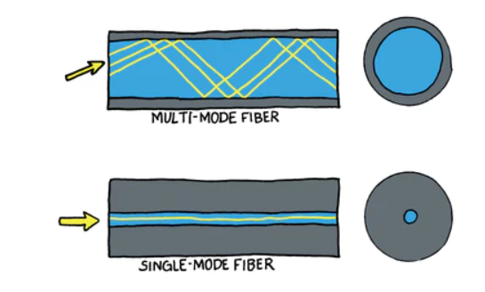
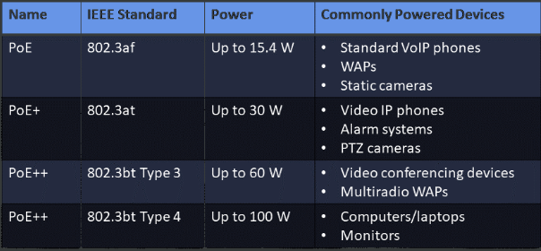

# Interfaces and Cables

## Copper Cables

### Unshielded Twisted Pair with RJ-45 Cables
UTP cables are segregated into different category ratings. A minimum rating of Category 3 is required to achieve a data transmission rate of up to 10 Mbps, which is also known as 10BaseT Ethernet. A minimum of Category 5 is required to achieve data rates of 100 Mbps, which is also known as Fast Ethernet or 100BaseTX Ethernet, or 1 Gbps, which is also known as Gigabit Ethernet or 1000BaseT Ethernet.
#### Crossover Vs. Straight-Through
A crossover cable uses a different standard at each end. A crossover cable should be used to connect two workstations, two switches, or two routers over the same Ethernet cable.  
By contrast, dissimilar Ethernet devices, such as a router and a switch, or a switch and a workstation, must be connected with a straight-through Ethernet cable. A straight-through cable uses the same pinout standard at each end.
### Serial Cables
Cisco devices support five types of serial cables. However, the most commonly used serial cable is a 25-pin EIA/TIA-232 cable with a DB-25 connector at either end.

One end of a serial cable is the data circuit-terminating equipment (DCE) end and the other end is the data terminal equipment (DTE) end.  
- The most important thing to remember about serial cables is that the <b>DCE end provides clocking to the DTE end.</b> If the correct clock rate is not configured on the DTE end, physical connectivity between the devices cannot be established.  
### Fibre Optic Cables
Fiber-optic cables are transmission mediums that use pulses of light to transmit data, offering high bandwidth and immunity to electromagnetic interference (EMI) and radio frequency interference (RFI).  
- Immunity to Interference: Not affected by RFI or EMI, making them suitable for environments with electrical or magnetic interference.
- High Bandwidth and Long Distances: Support greater bandwidth and longer distances than copper cables (UTP, STP, coaxial).
- Use Cases: Ideal for network backbones, high-speed data transfer, and connecting electrically incompatible buildings.
- Cost: Generally more expensive than copper cable alternatives. 

#### Fiber-Optic Cable Types:

Multimode Fiber (MMF):

- Core Size: 50 or 62.5 microns.
- Wavelength: Typically 850 nm or 1,300 nm.
- Distance: Suitable for distances less than 2 km, with signal dispersion limiting its usable distance.
- Usage: Campus designs needing at least 1 Gbps over short distances (<2 km).  

Single-mode Fiber (SMF):

- Core Size: 9 microns.
- Wavelength: Typically 1,310 nm or 1,550 nm.
- Distance: Can support network runs of 80 km or more due to limited signal dispersion.
- Usage: Designs requiring at least 10 Gbps over long distances (>2 km).  

### Power over Ethernet
  

PoE is a technology that allows electrical power to be passed along with data over the same Ethernet cable to devices such as IP phones and wireless access points (WAPs).

- Convenience: Enables the installation of devices in locations without immediate access to power outlets, as power is supplied through the network cable.
- Standards Support: Supports various standards including IEEE 802.3af, IEEE 802.3at, the newer IEEE 802.3bt (up to 90W), and Cisco's proprietary versions including Universal Power Over Ethernet (UPOE) supplying up to 60W.
- Compatibility: Works with both Cisco and non-Cisco devices that adhere to supported PoE standards.
- Power Management: Cisco Catalyst switches can monitor and manage power delivery, ensuring devices do not exceed power limits, with mechanisms to shut down ports in case of overdraw.
- Diagnostic Tools: Offers commands like `show inline power` for operational verification and troubleshooting of PoE on Cisco switches.

