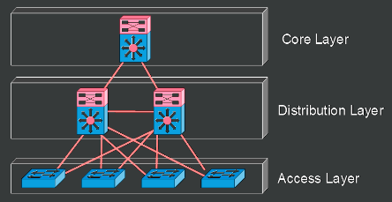

# Network Designs and Topologies
## Three-Tier Model
  
Three-Tier Model is a hierarchical model with three components:  
- Core Layer
  - Provides fastest switching path
  - Network backbone:
    - Low Latency
    - High Reliability
- Distribution Layer
  - Also referred to as Aggregation Layer.
  - Provides Route Filtering and Inter-VLAN Routing
  - Management ACLs and IPS Filtering at this layer.
  - Ideal place to enforce security policies due to being intermediary between Access and Core.
  - Summarization and Next-Hop Redundancy performed at this layer.
- Access Layer
  - Network Admission Control (NAC) at Access Layer.
    - Feature that prevents hosts from accessing the network based on organizational requirements.
  - Media termination point for servers and endpoints.
  - Since Access Layer provides access to the network to devices, ideal spot for user authentication and port security.
  - Access Layer determines VLAN assignment.
## Two-Tier

## Spine-Leaf Topology
## WAN Topologies
## SOHO Topologies