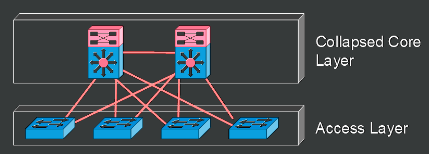
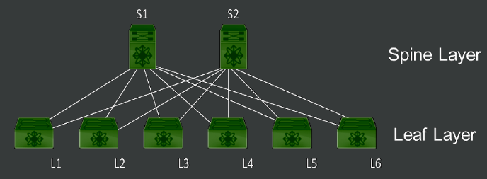

# Network Designs and Topologies
## Three-Tier Model
  
Three-Tier Model is a hierarchical model with three components:  
- Core Layer
  - Provides fastest switching path
  - Network backbone:
    - Low Latency
    - High Reliability
- Distribution Layer
  - Also referred to as Aggregation Layer.
  - Provides Route Filtering and Inter-VLAN Routing
  - Management ACLs and IPS Filtering at this layer.
  - Ideal place to enforce security policies due to being intermediary between Access and Core.
  - Summarization and Next-Hop Redundancy performed at this layer.
- Access Layer
  - Network Admission Control (NAC) at Access Layer.
    - Feature that prevents hosts from accessing the network based on organizational requirements.
  - Media termination point for servers and endpoints.
  - Since Access Layer provides access to the network to devices, ideal spot for user authentication and port security.
  - Access Layer determines VLAN assignment.
## Two-Tier
  
Two-Tier Model is a model that combines the Core and Distribution layers together, and is also sometimes called "Collapsed Core" model.  
In this model, the functionality of the Core Layer is "collapsed" into the Distribution Layer and a distinct Core Layer no longer exists. The Distribution Layer infrastructure must now be capable of meeting the overall design requirements.
## Spine-Leaf Topology

A two-tier, partial-mesh network architecture used in data centers, where every leaf switch connects to every spine switch, but leafs and spines do not connect to one another.  

## WAN Topologies
A WAN is a network that spans a large geographical area, potentially covering multiple cities or countries, with the Internet being the largest example.
- Geographical Scope: Covers extensive geographical areas, connecting dispersed local area networks (LANs).
- Service Provider Connectivity: Typically relies on service providers for WAN connectivity, connecting LANs through the network.
- Secure Tunneling: Often uses site-to-site VPNs for secure tunneling of traffic over the WAN, keeping service provider infrastructure invisible to the customer’s LAN.
- Representation: In network topology diagrams, WANs are often depicted as clouds due to the abstracted nature of their connectivity.
- Technological Evolution: Has evolved from older technologies like T1/T3 lines, Frame Relay, and ATM to newer ones such as MPLS (Multiprotocol Label Switching) and Metro Ethernet.  

### Multiprotocol Label Switching

Multiprotocol Label Switching (MPLS) is a flexible, high-performance routing technique used in telecommunications networks to speed up and shape traffic flows. It operates between traditional Layer 2 (Data Link Layer) and Layer 3 (Network Layer) of the OSI model, enabling more efficient data transmission across wide area networks (WANs).  

#### MPLS Fundamentals
- Label-Based Forwarding: Unlike traditional IP routing, where each router independently determines the next hop by examining the IP header of every packet, MPLS routes traffic based on labels. These labels are short, fixed-length identifiers assigned to packets at the ingress (entry) point of the MPLS network. The labels indicate the packet's forwarding path through the network, allowing routers (now acting as label switches) to quickly forward packets without needing to look up IP addresses.  
- Labels and Label Switch Routers (LSRs): In MPLS, packets are forwarded through the network by Label Switch Routers (LSRs). The first LSR (ingress router) assigns an initial label to each packet based on various criteria (like destination, QoS, etc.), and subsequent LSRs use this label to forward the packet along a predetermined path to the egress (exit) router, where the label is removed, and the packet is delivered to its final destination.  

#### MPLS Key Features
- Traffic Engineering: MPLS allows network operators to direct data flows across specific paths, optimizing network utilization and performance. This capability is particularly useful for managing bandwidth and prioritizing different types of traffic, ensuring that high-priority services (like VoIP or streaming video) have the necessary resources.
- Quality of Service (QoS): By assigning different labels to packets based on their required service quality, MPLS can provide varying levels of service to different types of traffic. This ensures that critical applications receive higher priority and more bandwidth than less critical ones.
- Scalability: MPLS supports a wide range of access technologies and can easily scale to handle large networks, making it suitable for both small and large service providers.
- Flexibility: It can encapsulate packets of various network protocols, making it compatible with existing technologies and easy to implement over existing infrastructures.  

#### How MPLS Works
1) Packet Labeling: At the ingress of the MPLS network, a router examines the packet's destination IP address and other factors, assigning an appropriate label that dictates the packet's forwarding path.

2) Label Switching: As the packet traverses the network, each MPLS router (LSR) uses the label to quickly forward the packet without needing to analyze the IP header, significantly speeding up the process.

3) Label Modification/Removal: The label may be changed (swapped) by intermediate routers as it moves through the network. Finally, at the egress point, the label is removed, and the packet is delivered based on its original IP address.
## SOHO Topologies
As telecommuting becomes more prevalent, small office/home office (SOHO) topologies are becoming commonplace. A SOHO topology is typically a small LAN or WLAN with one or more computers. The LAN or WLAN is connected to a service provider network, typically over satellite, Digital Subscriber Line (DSL), cable, and fiber to the Internet. Satellite and DSL are older and slower technologies, whereas cable and fiber are faster technologies.

## On-Premises and Cloud Deployments

### On-Premises Deployment
On-premises deployments refer to the local setup, configuration, and maintenance of IT infrastructure and services within an organization's physical premises.

- Full Control: Organizations have complete authority over their network, systems, and data.
- Initial Investment: Requires upfront purchasing of hardware and software.
- Maintenance Responsibility: The organization is responsible for the ongoing maintenance, updates, and security of the deployment.
- Staffing Requirements: Necessitates hiring specialized staff for system management and maintenance, leading to higher operational costs.

### Cloud Deployment
Cloud deployments involve utilizing remote servers hosted on the Internet (managed by cloud providers) to store, manage, and process data, rather than using local servers or personal computers.

- Provider Ownership: The cloud provider owns and maintains the necessary hardware and software.
Cost Structure: Typically incurs a monthly usage fee, offering lower upfront costs compared to on-premises setups.
- Reduced Staffing Needs: Eliminates the need for hiring and training technical staff for maintenance.
- Limited Customization and Control: Offers less customization and control over the infrastructure than on-premises deployments.
- Operational Risk: Relies on consistent Internet service for access; interruptions can lead to loss of access.
- Security Concerns: Data is stored on third-party servers, potentially increasing the risk of data breaches due to inadequate security measures.

### Service Models
#### Software as a Service
SaaS is a cloud computing model that provides access to applications hosted on a cloud infrastructure, accessible via the internet, without giving users control over the infrastructure or application configuration.

- Cloud-Based Applications: Users access applications running on the cloud, typically through a web browser.
- Limited Management Responsibility: Users cannot manage the cloud infrastructure or configure applications, focusing instead on using the software.
- Minimal Network Exposure: Exposes the least amount of the consumer’s network to the cloud, unlikely to require significant changes to network design.
- Subscription-Based Licensing: Typically involves an Internet-enabled licensing model, either through streaming services or web applications.
- Examples: Web-based email clients, Microsoft Office 365, Google Drive, and iCloud, which allow users to create and manipulate data using the provider’s tools.

#### Platform as a Service
PaaS is a cloud computing model that offers an environment where consumers can develop, run, and manage applications without dealing with the underlying infrastructure.

- Deployment Flexibility: Allows the installation and configuration of provider-supported applications.
- Development Tools: Offers access to development tools or APIs for creating cloud-based applications.
- Examples of Use: Utilizing third-party services like MySQL database and Apache to build applications such as a CRM platform.

#### Infrastructure as a Service
IaaS is a cloud computing model that offers virtualized physical computing resources over the Internet, providing the highest level of flexibility among cloud service models.

- Resource Provisioning: Allows consumers to provision processing, memory, storage, and networking resources.
- System Control: Enables the installation of operating systems and applications by the consumer.
- Service Provider Control: The underlying cloud infrastructure is managed and maintained by the service provider.
- Flexibility and Scalability: Offers significant flexibility in configuring virtual or physical hosts for a variety of applications.
- Cost Efficiency: Reduces the need for physical hardware investment, offering a cost-effective solution for scaling computing resources.