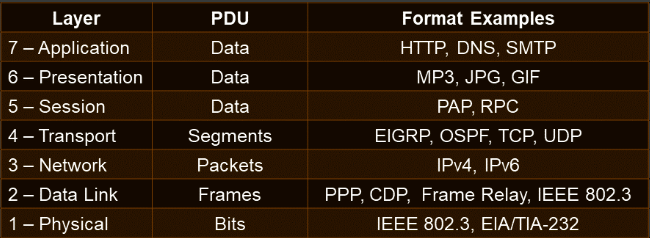

# OSI Model

The OSI Model is used to divide data communications into seven distinct layers, shown below:

  
## Layers of the OSI Model

### Application Layer (7)
The Application Layer is responsible for converting data into a format that is usable by applications and directing the data to the proper application window.  

- Delivers formatted payload to the correct instance of an application.
- HTTP, FTP and SMTP are some examples of applications at this layer.  

### Presentation Layer (6)
The Presentation Layer is responsible for converting and representing the payload in different formats, including:
- data-based
- character-based
- image-based
- audio-based
- video-based  

Compression and encryption are often handled at this layer.  

Formats used at this layer:
- GIF
- JPEG
- MPEG
- QuickTime  

### Session Layer (5)
The Session Layer is responsible for establishing, maintaining and terminating data communications between applications and devices.  
A session is made of a requests and responses.  
Protocols at this layer include:  
- Password Authentication Protocol (PAP)
- Remote Procedure Call (RPC)  

### Transport Layer (4)
The Transport Layer is responsible for:  
- Error-free delivery of information between devices.
- Flow Control
- Sequencing  

Protocols that operate at the Transport Layer include:
- Enhanced Interior Gateway Routing Protocol (EIGRP) which is a Cisco-created advanced Distance-Vector routing protocol.
- Open Shortest Path First (OSPF) which is a link-state routing protocol.
- User Datagram Protocol (UDP) provides connectionless, unreliable data transfer between networked computers.
- Transmission Control Protocol (TCP) provides connection-oriented, reliable data transfer between networked computers.  

- Segments traverse the Transport Layer.

- Flow control and error detection at this layer.

### Network Layer (3)
The Network Layer is responsible for logical addressing and routing over a network. The most common logical addressing method used is Internet Protocol Versions 4 and 6 (IPv4 and IPv6).  
- Packets traverse the Network Layer
- Routers are common devices at the Network Layer
- Protocols: IPv4, IPv6 and IPX  

### Data Link Layer (2)
The Data Link Layer defines how devices communicate over a network and is responsible for managing physical addressing and switching on a network. For example:  
Physical Addresses that are known as MAC Addresses are handled by the Data Link Layer.  
Switching is handled at the Data Link layer because switches use a devices physical address to forward data as Frames to the correct port.  

Protocols that operate at the Data Link Layer include:  
- Ethernet
- Frame Relay
- Point-to-Point Protocol (PPP)
- Cisco Discovery Protocol (CDP)  

Notes on the Data Link Layer:
- Frames traverse the Data Link Layer
- The Data Link Layer devices include Switches and Bridges.  

Ethernet:  
Ethernet is also known as Institute of Electrical and Electronics Engineers (IEEE) 802.3 and can operate at Layer 1 and Layer 2. Like Ethernet, some portions of the 802.11 wireless standard function at the Data Link layer and some portions function at the Physical layer.

### Physical Layer (1)
The Physical Layer defines how bits are passed over a medium. These bits can be passed:  
- Electrically
- Mechanically
- Optically
- Radio-Signals  

And the medium can be things such as:  
- Coaxial Cable
- Twisted-Pair Copper Cable
- Fibre-Optic Cable
